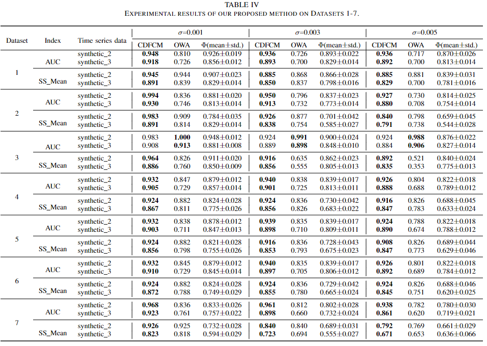
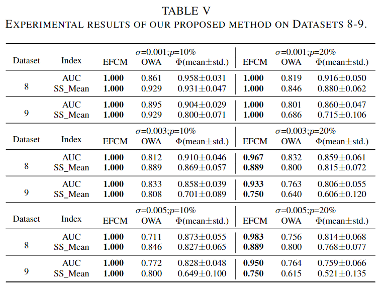
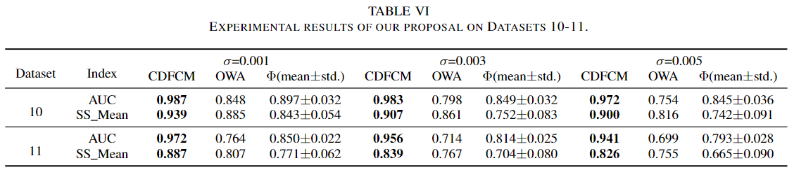
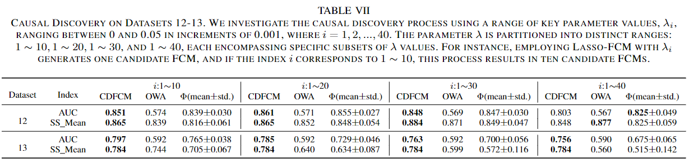
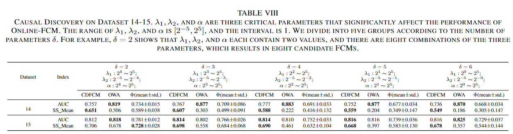

### 从噪声模糊认知图集中因果发现【公式详细解析】

论文链接：[https://ieeexplore.ieee.org/abstract/document/10495183](https://ieeexplore.ieee.org/abstract/document/10495183)

代码链接：[https://github.com/IngeTeng/Abundant-but-Noisy-FCMs](https://github.com/IngeTeng/Abundant-but-Noisy-FCMs)

#### 一、研究动机：
* 近年来，涌现了大量基于模糊认知图（Fuzzy cognitive map，FCM）模型用于因果推断的方法（例如，推断基因调控网络）。然而，在一个真实的场景中，无法得知ground truth情况下，对于决策者而言，哪一种方法得到的FCM最能表示真实的因果关系？

* 受超参数的影响，单一方法也会产生不同性能的FCM。

* 另外，还有许多由不同领域专家，依靠专家知识构建的不同性能的FCM。

上述情况将会导致产生大量含噪声的候选因果关系集（FCMs）。

<u>*对于决策者而言，在没有先验知识的情况下，如何从上述大量含有噪声的数据集中，推断更真实的因果关系？*</u>  **这个问题首次得到关注**，基于此，我们提出了一个基于**贝叶斯**和**模糊理论**的无参数模型，**CDFCM**。图1是CDFCM因果推断的示例。

图1 CDFCM因果推断示例

**关键词**： **模糊认知图**，**因果推断**，**贝叶斯理论**，**模糊理论**

#### 二、算法模型

##### 1、问题定义
我们假设观测数据（因果关系数据集）$\Phi$和真实因果（ground truth） $\Omega$之间可以用一个**数据概率模型**表示 $P(\Phi|\Omega, \theta)$。本工作旨在对候选FCM数据集 $\Phi$进行因果发现，以推断最接近最优的因果关系 $\Omega$。<u>我们算法的**目的**是通过计算最优的参数 $\theta$来确定这个概率模型。进而通过观测数据 $\Phi$与模型参数 $\theta$得到最接近真实（概率最大）的因果$\Omega$。</u>

##### 2、算法基本原理
首先根据贝叶斯公式，我们可以得到 $P(\Omega, \theta|\Phi)$（从已知观测数据到待求参数的概率），

$$
P(\Omega, \theta|\Phi) = \frac{{P(\Phi|\Omega, \theta)P(\Omega)P(\theta)}}{{P(\Phi)}}
$$
总结所有可能的FCM真实因果结构 $\Phi$，我们得到 $P(\theta|\Phi) = \sum\nolimits_\Omega {P(\Omega, \theta|\Phi)}$，我们通过寻找最大化的$P(\theta|\Phi)$，即计算观测数据 $\Phi$下参数 $\theta$的最大后验概率，目的是为了得到最可能得参数$\theta$。通过最大化 $P(\theta|\Phi)$，我们可以有效的建模ground truth $\Omega$ 和观测数据（即候选FCMs）之间的关联。最终，我们可以很容易的从候选FCMs中估计最优的因果关系。**这个是我们文章的核心原理。**

为了方便计算，我们最大化 $log P(\theta|\Phi)$, 利用Jensen不等式，
$$
\log P(\theta|\Phi) = \log \sum\limits_\Omega{P(\Omega, \theta |\Phi)} \ge \sum\limits_\Omega {q(\Omega)\log\frac{{P(\Omega, \theta|\Phi)}}{{q(\Omega)}}} 
$$
其中 $q(\Omega)$ 表示任意$\Omega$的分布概率，它满足$\sum\nolimits_\Omega  {q(\Omega)} = 1$，即所有$\Omega$的分布概率是为1的。当公式（2）中左侧与右侧相等时，右侧公式的值达到最大。此时的
$$
q(\Omega ) = \frac{{P(\Omega ,\theta |\Phi )}}{{\sum\nolimits_\Omega  {P(\Omega ,\theta |\Phi )} }}
$$
决定$\log P(\theta|\Phi)$最大化的两个变量为 $q(\Omega)$ 和 $\log P(\Omega, \theta|\Phi)$。通过公式（3）可以最大化$q(\Omega)$；求$\log P(\Omega, \theta|\Phi)$的最大值，此时将$q(\Omega)$看做常数，即求$\log P(\Omega, \theta|\Phi)$对于$\theta$的偏导数。因此，最大化$\log P(\theta|\Phi)$时，$\theta$满足以下公式：
$$
\sum\limits_\Omega  {q(\Omega )} {\nabla _\theta }\log P(\Omega ,\theta |\Phi ) = 0
$$
其中 ${\nabla _\theta }\log P(\Omega ,\theta |\Phi )$ 表示$\log P(\Omega, \theta|\Phi)$对$\theta$的偏导数。

算法随机初始化$\theta$后就在公式（3）和（4）之间迭代直至收敛。至此得到了模型性能最优时最大概率的$\theta$值。一旦$\theta$被确定，就可以利用公式（3），求得最优$\Omega$的分布概率 $q(\Omega)$，
$$
q(\Omega ) = \frac{{P(\Omega ,\theta |\Phi )}}{{\sum\nolimits_\Omega  {P(\Omega ,\theta |\Phi )} }}{\rm{ = }}\frac{{P(\Omega ,\theta |\Phi )}}{{P(\theta |\Phi )}} = P(\Omega |\Phi ,\theta )
$$
以上就是我们算法的基本原理。下面将介绍，对应到FCM图中每个边是如何因果推断的。

##### 3、算法细节

首先，得到用以表示因果关系的FCM，可能是带有权重的。在推断节点变量之间关系为“促进”或“抑制”之前，我们需要对权重进行模糊化，模糊为标签离散变量，可以通过图2的成员函数，本文中模糊为三种状态即“促进”、“抑制”和“不相关”。当然，也可以直接通过数值截断的方式，得到3个，6个或更多的状态。

图2 3个文章中使用的成员函数

$\Omega$表示真实因果的邻接矩阵，每个$\Omega_{ij}$元素表示三种状态：0-抑制、1-不相关和2-促进。参数$\theta={\rho_0, \rho_1, \rho_2, \gamma_0, \gamma_1, \gamma_2}$ 。其中$\rho_0$, $\rho_1$, 和 $\rho_2$表示每条边三个状态的先验概率，其中$\rho_0+\rho_1+\rho_2=1$。$\gamma_0$, $\gamma_1$和 $\gamma_2$表示每条边三个状态的观测概率。在$N$个候选FCM中，$N_{ij}$为节点对 $i, j$的总测量次数。$E_{ij}$表示观测到边存在的统计次数。假设对于每条边三个状态的观测概率$\gamma_0$, $\gamma_1$和 $\gamma_2$都服从Bernoulli分布，则
$$
P(\Phi {\rm{|}}\Omega ,\theta ) = & {\prod\limits_{i,j} {[{\gamma _0}^{{E_{ij}}}{{(1 - {\gamma _0})}^{({N_{ij}} - {E_{ij}})}}]} ^{{I_{{\Omega _{ij}}{\rm{ = }}0}}}}\\
& \times {[{\gamma _1}^{{E_{ij}}}{(1 - {\gamma _1})^{({N_{ij}} - {E_{ij}})}}]^{{I_{{\Omega _{ij}}{\rm{ = }}1}}}}\\
& \times {[{\gamma _2}^{{E_{ij}}}{(1 - {\gamma _2})^{({N_{ij}} - {E_{ij}})}}]^{{I_{{\Omega _{ij}}{\rm{ = }}2}}}}
$$
其中$I(\cdot)$为指示函数
$$
{I_{conditions}} = \left\{ {\begin{array}{*{20}{c}}
1&{{\rm{if\thinspace conditions\thinspace is\thinspace True}}}\\
0&{{\rm{if\thinspace conditions\thinspace is\thinspace False}}}
\end{array}} \right.
$$
根据每条边3个状态的先验概率$\rho_0, \rho_1, \rho_2$。  $\Omega$的先验概率为
$$
P(\Omega {\rm{|}}{\rho _0},{\rho _1},{\rho _2}) = \prod\limits_{i,j} {{\rho _0}^{{I_{{\Omega _{ij}} = 0}}}} {\rho _1}^{{I_{{\Omega _{ij}} = 1}}}{\rho _2}^{{I_{{\Omega _{ij}}{\rm{ = }}2}}}
$$
我们假设$\rho_0, \rho_1, \rho_2, \gamma_0, \gamma_1$  和$\gamma_2$服从[0,1]均匀的先验概率分布。根据公式（1），结合（6）和（8）可得
$$
\begin{aligned}
P(\Omega ,\theta {\rm{|}}\Phi {\rm{)}} = &\frac{1}{\Phi }{\prod\limits_{i,j} {[{\rho _0}{\gamma _0}^{{E_{ij}}}{{(1 - {\gamma _0})}^{({N_{ij}} - {E_{ij}})}}]} ^{{I_{{\Omega _{ij}}{\rm{ = }}0}}}}\\
&\times {[{\rho _1}{\gamma _1}^{{E_{ij}}}{(1 - {\gamma _1})^{({N_{ij}} - {E_{ij}})}}]^{{I_{{\Omega _{ij}}{\rm{ = }}1}}}}\\
&\times {[{\rho _2}{\gamma _2}^{{E_{ij}}}{(1 - {\gamma _2})^{({N_{ij}} - {E_{ij}})}}]^{{I_{{\Omega _{ij}}{\rm{ = }}2}}}}
% \end{array}
\end{aligned}
$$
计算$\log P(\Omega, \theta|\Phi)$
$$
\begin{aligned}
\log & P(\Omega ,\theta |\Phi ) = \sum\nolimits_{i,j} \{ \\
& \quad { {I_{{\Omega _{ij}} = 0}}\left[ {{E_{ij}}\log {\gamma _0} + ({N_{ij}} - {E_{ij}})\log (1 - {\gamma _0})} \right]} \\
& +{I_{{\Omega _{ij}} = 1}}\left[ {{E_{ij}}\log {\gamma _1} + ({N_{ij}} - {E_{ij}})\log (1 - {\gamma _1})} \right]\\
& +{I_{{\Omega _{ij}} = 2}}\left[ {{E_{ij}}\log {\gamma _2} + ({N_{ij}} - {E_{ij}})\log (1 - {\gamma _2})} \right]\\
& + {I_{{\Omega _{ij}} = 0}}\log {\rho _0} + {I_{{\Omega _{ij}} = 1}}\log {\rho _1} + {I_{{\Omega _{ij}} = 2}}\log {\rho _2}\} \\
& - \log P(\Phi )
\end{aligned}
$$
我们根据基本原理部分的公式（4），对$\log P(\Omega, \theta|\Phi)$求关于$\theta={\rho_0, \rho_1, \rho_2, \gamma_0, \gamma_1, \gamma_2}$的偏导。以$\gamma_0$为例，求公式（10）关于$\gamma_0$的偏导，最大的后验概率$\hat{\gamma_0}$满足
$$
\sum\limits_\Omega  {q(\Omega )} \sum\limits_{i,j} {{I_{{\Omega _{ij}}{\rm{ = }}0}}\left( {\frac{{{E_{ij}}}}{{{{\hat \gamma }_0}}} - \frac{{{N_{ij}} - {E_{ij}}}}{{1 - {{\hat \gamma }_0}}}} \right)} {\rm{ = }}0
$$
计算求得$\hat{\gamma_0}$
$$
{\hat \gamma _0} = \frac{{\sum\nolimits_{i,j} {{E_{ij}}K_{ij}^{(0)}} }}{{\sum\nolimits_{i,j} {{N_{ij}}K_{ij}^{(0)}} }}
$$
其中$K_{ij}^{(\tau )} = \sum\nolimits_\Omega{{I_{{\Omega _{ij}}{\rm{ = }}\tau }}} q(\Omega )$ 是后验概率, $\Omega_{ij}=\tau, \tau=0, 1, 2$。相似的，计算所有参数$\gamma_1, \gamma_2, \rho_0, \rho_1$和$\rho_2$ 
$$
{\hat \gamma _\tau } = \frac{{\sum\nolimits_{i,j} {{E_{ij}}K_{ij}^{(\tau )}} }}{{\sum\nolimits_{i,j} {{N_{ij}}K_{ij}^{(\tau )}} }}
$$

$$
{\hat \rho _\tau } = \frac{1}{{\left( {\begin{array}{*{20}{c}}
n\\
2
\end{array}} \right)}}\sum\limits_{i,j} {K_{ij}^{(\tau )}}
$$

至此，我们得到了$\theta$中包含的全部参数。回顾上述提到的基本原理，我们可以根据$\theta$，计算最接近ground truth的概率分布$q(\Omega)$，我们将公式（9）代入到（5）中
$$
\begin{array}{l}
q(\Omega ) = \frac{{\prod\nolimits_{i,j} {\prod\nolimits_{\tau  = 0,1,2} {{{[{{\hat \rho }_\tau }{{\hat \gamma }_\tau }^{{E_{ij}}}{{(1 - {{\hat \gamma }_\tau })}^{{N_{ij}} - {E_{ij}}}}]}^{{I_{{\Omega _{ij}}{\rm{ = }}\tau }}}}} } }}{{\sum\nolimits_\Omega  {\prod\nolimits_{i,j} {\prod\nolimits_{\tau  = 0,1,2} {{{[{{\hat \rho }_\tau }{{\hat \gamma }_\tau }^{{E_{ij}}}{{(1 - {{\hat \gamma }_\tau })}^{{N_{ij}} - {E_{ij}}}}]}^{{I_{{\Omega _{ij}}{\rm{ = }}\tau }}}}} } } }}\\
{\rm{         = }}\prod\limits_{i,j} {\frac{{\prod\nolimits_{\tau  = 0,1,2} {{{[{{\hat \rho }_\tau }{{\hat \gamma }_\tau }^{{E_{ij}}}{{(1 - {{\hat \gamma }_\tau })}^{{N_{ij}} - {E_{ij}}}}]}^{{I_{{\Omega _{ij}}{\rm{ = }}\tau }}}}} }}{{\sum\nolimits_{{\Omega _{ij}} = 0,1,2} {\prod\nolimits_{\tau  = 0,1,2} {{{[{{\hat \rho }_\tau }{{\hat \gamma }_\tau }^{{E_{ij}}}{{(1 - {{\hat \gamma }_\tau })}^{{N_{ij}} - {E_{ij}}}}]}^{{I_{{\Omega _{ij}}{\rm{ = }}\tau }}}}} } }}} \\
{\rm{         = }}\prod\limits_{i,j} {\prod\limits_{\tau  = 0,1,2} {K{{_{ij}^{(\tau )}}^{{I_{{\Omega _{ij}} = \tau }}}}} } 
\end{array}
$$
其中
$$
K_{ij}^{(\tau )} = \frac{{{{\hat \rho }_\tau }{{\hat \gamma }_\tau }^{{E_{ij}}}{{(1 - {{\hat \gamma }_\tau })}^{{N_{ij}} - {E_{ij}}}}}}{{\sum\nolimits_{\tau '} {{{\hat \rho }_{\tau '}}{{\hat \gamma }_{\tau '}}^{{E_{ij}}}{{(1 - {{\hat \gamma }_{\tau '}})}^{{N_{ij}} - {E_{ij}}}}} }}
$$
**我们只需要根据公式（13）（14）和（16）不断迭代至收敛，则根据（15）得到最优的$\Omega$。**

#### 三、实验及讨论

算法部分我们从时间序列数据中生成了**15个因果数据集**，来模拟"大量含有噪声"的多个场景。这些时间序列为合成与真实的基因调控网络数据（GRN）。分别采用了AUC和SS_Mean作为评价指标，均与grounth truth相比，越接近则评价指标越大。具体的实验设置细节可参考论文。

**数据集1-7**（GRN合成数据）：我们在生成因果数据集的时间序列中增加了不同水平的高斯噪声。从上表中可以看出，我们的算法（CDFCM）在大部分数据集上性能最优，且受噪声影响最小。

**数据集8-9**（GRN合成数据）：我们在生成因果数据集的时间序列中增加了不同水平的噪声和缺失值。从上表看出CDFCM具有很强的鲁棒性。

**数据集10-11**（GRN合成数据）：在此数据集中，我们利用了6种不同的FCM学习方法来得到因果数据集，模拟真实情况中，对于决策者选择模型困难的问题。从上表中可以看出CDFCM的性能远高于这些FCM学习方法性能的均值。

**数据集12-13**（GRN真实数据）：此数据集的生成利用了Lasso-FCM方法和真实的基因调控网络数据，模拟真实情况中，不同超参数对性能带来的偏差影响。从上表可以看出，在大多数参数范围内，CDFCM都可以表现出较高的性能。

**数据集14-15**（GRN真实数据）：此数据集的生成利用了Online-FCM方法和真实的基因调控网络数据，从上表可以看出，在更复杂的参数组合中，CDFCM都可以表现出较高的性能。

*跟多详细的性能分析与鲁棒性讨论可见论文*。

#### 结论
因果推理是人工智能的一个重要领域，其特点是各种因果推理方法的涌入。然而这些方法各有优缺点，给决策者提供更好的因果关系同时也带来了新的挑战。我们假设，大量的因果推理方法可以产生丰富但有噪声的因果关系数据集。我们的论文没有建立新的因果发现的方法，而是解决了一个新颖而关键的问题: **如何从这些丰富而含有噪声的数据集中推断出强大的因果关系?**

为了解决这一挑战，我们提出了一个基于贝叶斯和模糊理论的无参数模型，旨在从候选因果关系数据集中准确估计真实系统中的因果关系。我们的研究结果证明了我们的方法在几个关键方面的有效性:

* 1)在噪声的数据环境中保持稳定性;
* 2)协调算法的多样性，以获得精确的因果推断;
* 3)缓解超参数引起的波动。
